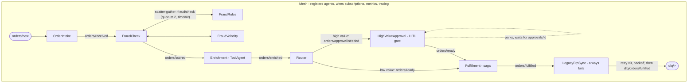

# Bus First Multi-Agent System

**Event-driven multi-agent orchestration: agents as event consumers on a
wildcard topic bus, with sagas, scatter-gather, dead-letter queues,
human-in-the-loop gates, and causal tracing.**

Zero runtime dependencies. TypeScript, strict, ESM. Everything verifies
offline with deterministic mock agents — `npm test` runs 74 tests, `npm run
demo` runs a full order-processing mesh and prints its causal trace.

## Why

Multi-agent systems are usually built orchestrator-first: a central planner
calling agents like functions. This runtime is built **bus-first**: agents
declare subscriptions on hierarchical topics (`orders/*`, `dlq/>` —
Solace-style single-level `*` and multi-level `>` wildcards), publish child
envelopes that preserve correlation chains, and coordination is a small
library of explicit patterns on top of the bus. The payoff is loose
coupling, observability as a property of the transport (not per-agent
instrumentation), and failure handling as ordinary messages. See
[docs/design.md](docs/design.md) for the full argument.

## Architecture



Layers, bottom up:

| Module | What it is |
| ------ | ---------- |
| `bus.ts` | `Bus` interface + `InMemoryBus`: wildcard topic matching, per-subscriber bounded queues, backpressure (`block` / `drop-oldest` / `drop-new`), request/reply. The broker-adapter seam — a Solace/MQTT/AMQP adapter implements the same interface. |
| `envelope.ts` | Typed message envelope: id, topic, `causationId`, `correlationId`, headers, payload. Child derivation keeps causal chains intact. |
| `agent.ts` | Agents as named event consumers/producers, `ToolAgent` (wraps a deterministic function), `LLMAgent` + `LLMProvider` seam with a scripted `MockLLM` for offline determinism. |
| `mesh.ts` | The orchestrator: registration, wiring, lifecycle, per-agent metrics (processed/failed, real latency percentiles), queue depths. |
| `patterns.ts` | Saga with compensation, scatter-gather with quorum + timeout, retry with exponential backoff then DLQ, human-in-the-loop `ApprovalGate` with timeout escalation. |
| `trace.ts` | Ring-buffer event trace (publish/deliver/ack/fail/drop), JSONL export, `traceOf(correlationId)`, ASCII causal-tree rendering. |
| `asyncapi.yaml` | AsyncAPI 2.6 contract for the example mesh's channels and messages. |

## Quickstart

```bash
npm install
npm run build   # tsc, strict
npm test        # vitest, 74 tests, all offline
npm run demo    # node dist/examples/order-mesh.js
```

## What the demo shows

Two orders enter the mesh. The $250 order flows straight through; the $5,200
order is parked by the HITL gate until a (simulated) human approves it. A
deliberately broken ERP sync exhausts its retry budget and dead-letters both
fulfilled orders. Then the mesh prints the causal tree per order — every hop,
including the human pause, reconstructed purely from envelope causation ids:

```text
[HITL] B-2002 parked, awaiting human approval...
[FULFILLED] A-1001 total=$250 tier=standard fraudScore=0.2
[DLQ] dlq/orders/fulfilled agent=LegacyErpSync retries=3 error="Error: ERP endpoint unreachable"
[HITL] B-2002 approved by demo-human, resuming flow
[FULFILLED] B-2002 total=$5200 tier=gold fraudScore=0.7

--- causal trace: order B-2002 (correlation 5290a054) ---
orders/new #5290a054  -> [OrderIntake ok]
`- orders/received #affe0133  -> [FraudCheck ok]
   |- fraud/check #a1dc3c50  -> [FraudRules ok, FraudVelocity ok]
   |  |- gather/19383741 #e18bb815  -> [gather ok]
   |  `- gather/19383741 #b395b48c  -> [gather ok]
   `- orders/scored #967a12f7  -> [Enrichment ok]
      `- orders/enriched #3c9a76f6  -> [Router ok]
         `- orders/approval/needed #8c89fc03  -> [HighValueApproval ok]
            |- approvals/requested #6599a975  -> [HighValueApproval ok, DemoApprover ok]
            |  `- approvals/B-2002 #4e8116e3  -> [HighValueApproval ok]
            `- orders/ready #7496d282  -> [Fulfillment ok]
               |- saga/fulfillment/reserve-inventory/started #dfcc790b
               |- saga/fulfillment/reserve-inventory/completed #b4caa59d
               |- saga/fulfillment/charge-payment/started #bd0e2277
               |- saga/fulfillment/charge-payment/completed #b69dea07
               `- orders/fulfilled #ef7cd483  -> [FulfillMonitor ok, LegacyErpSync FAILED: Error: ERP endpoint unreachable]
                  `- dlq/orders/fulfilled #16f03060  -> [DlqMonitor ok]

--- agent metrics ---
agent             processed  failed  p50/p95/p99 ms
OrderIntake       2          0       0.2/0.7/0.7
FraudCheck        2          0       0.4/0.8/0.8
HighValueApproval 3          0       0.2/0.4/0.4
Fulfillment       2          0       0.2/0.8/0.8
LegacyErpSync     0          2       0.0/0.0/0.0
DemoApprover      1          0       252.0/252.0/252.0
```

## Design notes (short version)

- **Bus-first vs orchestrator-first.** The `Mesh` holds no workflow state;
  workflow state lives in messages. Coordination patterns are library code
  over the bus, not framework magic. Rationale in
  [docs/design.md](docs/design.md).
- **Backpressure is a policy, not an accident.** Bounded per-subscriber
  queues with `block` (default, end-to-end flow control), `drop-oldest`
  (freshest-wins telemetry), or `drop-new` (protect admitted work). Drops are
  counted and traced.
- **The broker seam is explicit.** `Bus` is shaped like the subset of a real
  event broker the runtime needs: hierarchical topics with Solace-style `*`
  and `>` wildcards (MQTT `+`/`#`, AMQP `*`/`#` map onto the same matcher),
  reply-to based request/reply, header metadata. `InMemoryBus` is the
  reference implementation; agent code never touches broker specifics.
- **HITL is first-class.** An autonomous flow that can park, wait for a
  human decision, escalate on timeout, and resume *with its causal chain
  intact* — that is the difference between a demo and something deployable.
- **Honest offline story.** No LLM keys, no network. `LLMProvider` is the
  seam; `MockLLM` keeps every test deterministic.

## Limitations

In-process only (no persistence or cross-restart delivery guarantees);
retries are handler-level, not broker redelivery; parked HITL state is
in-memory; the AsyncAPI contract is documentation, not runtime-enforced
validation. Each of these is a seam, not a wall — details in
[docs/design.md](docs/design.md).

## License

MIT
